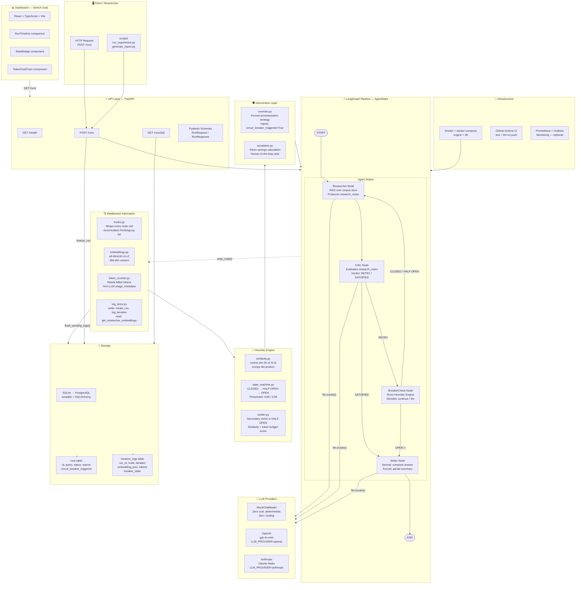
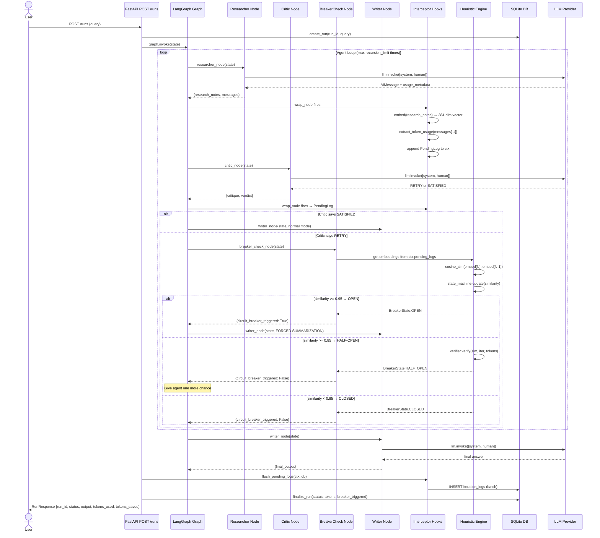
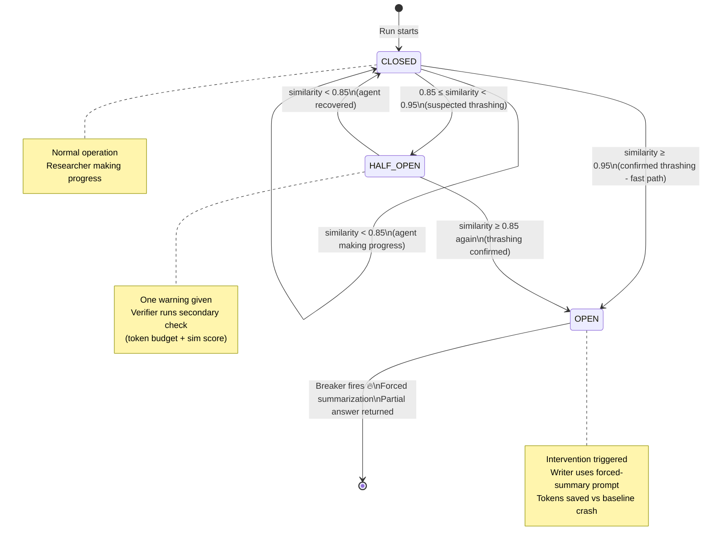
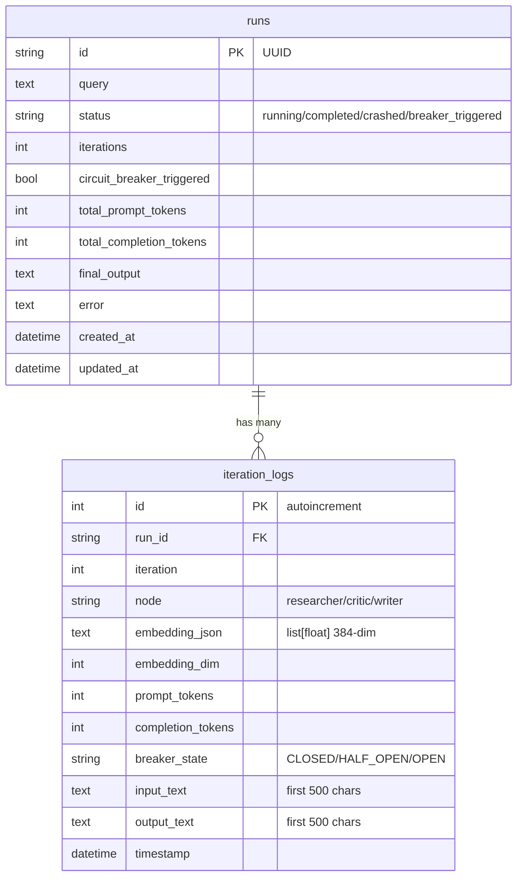
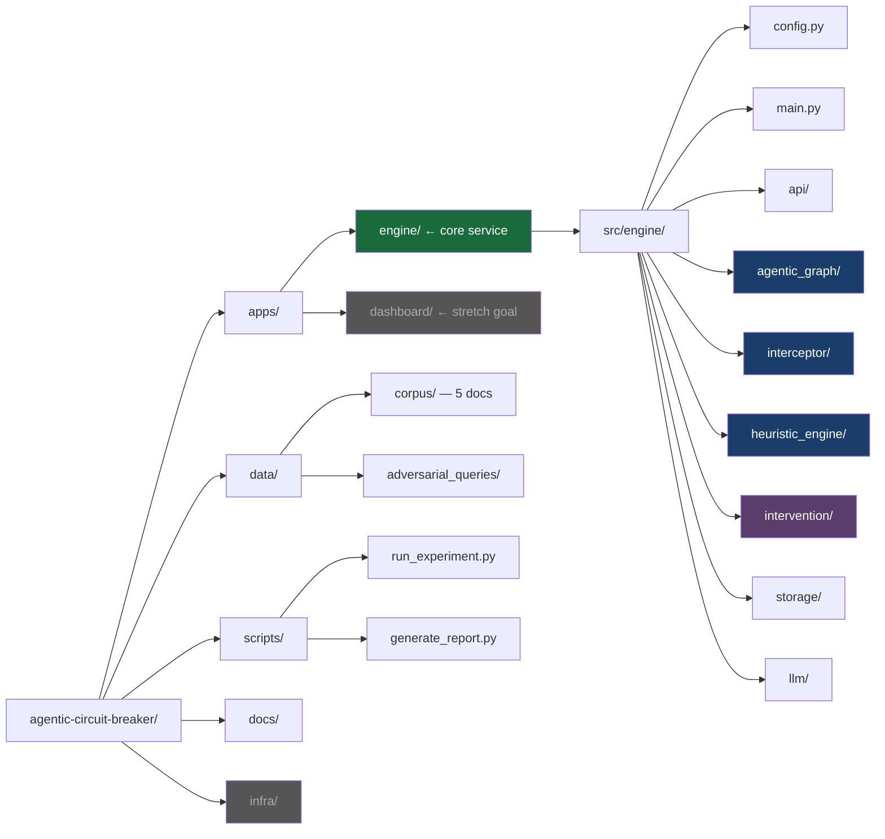

# Agentic Circuit Breaker — Architecture Diagrams

---

## Diagram 1 — Full System Architecture (Component View)

---

## Diagram 2 — Request Lifecycle (Sequence View)

---

## Diagram 3 — State Machine (Circuit Breaker FSM)

---

## Diagram 4 — Data Model (Storage Layer)

---

## Diagram 5 — Folder Structure Map

