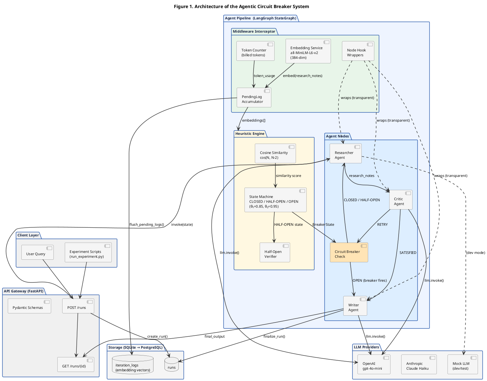
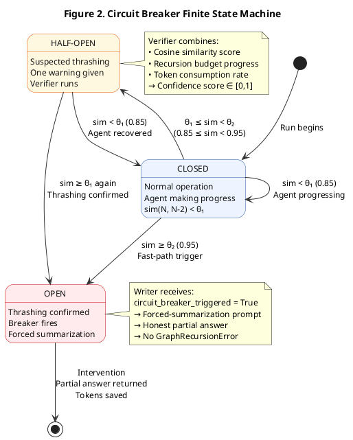
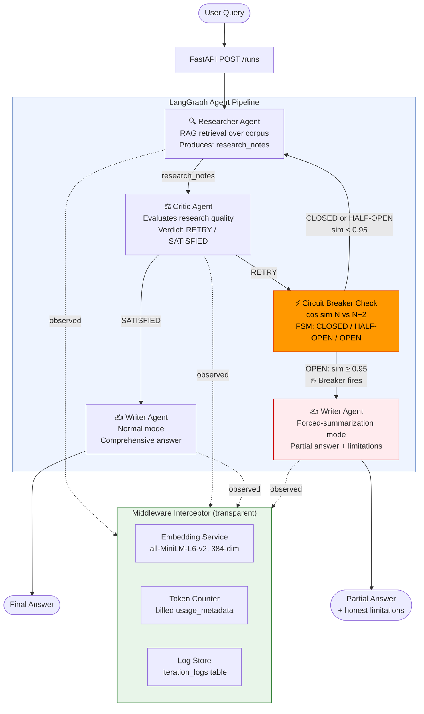

# Agentic Circuit Breaker — Research Paper Diagrams

> Render PlantUML at: https://www.plantuml.com/plantuml/uml/
> Render Mermaid at: https://mermaid.live/

---

## Figure 1 — System Architecture (PlantUML)
*Use this as "Fig. 1" in your paper*



---

## Figure 2 — Circuit Breaker State Machine (PlantUML)
*Use this as "Fig. 2" in your paper*



---

## Figure 3 — Agent Pipeline Flow (Mermaid — for GitHub/Notion)
*Simpler flow diagram, good for presentations*



---

## How to Include in Your Paper

### LaTeX (IEEE format):
```latex
\begin{figure}[t]
  \centering
  \includegraphics[width=\columnwidth]{figures/architecture.png}
  \caption{System architecture of the Agentic Circuit Breaker. The
           middleware interceptor observes each agent node transparently,
           computing sentence embeddings per iteration. The heuristic engine
           detects semantic thrashing via cosine similarity and drives a
           three-state FSM (CLOSED/HALF-OPEN/OPEN). When the breaker opens,
           the Writer agent produces a graceful partial answer instead of
           crashing.}
  \label{fig:architecture}
\end{figure}

\begin{figure}[t]
  \centering
  \includegraphics[width=0.85\columnwidth]{figures/state_machine.png}
  \caption{Circuit Breaker Finite State Machine. Thresholds $\theta_1=0.85$
           and $\theta_2=0.95$ are configurable via environment variables.
           The HALF-OPEN state prevents false positives by requiring two
           consecutive high-similarity readings before firing.}
  \label{fig:fsm}
\end{figure}
```

### Caption for Fig. 1:
> *Fig. 1. System architecture of the Agentic Circuit Breaker middleware. Dashed lines indicate transparent observation by the interceptor layer. The circuit breaker check node (highlighted) is the key contribution, preventing GraphRecursionError by detecting semantic thrashing via cosine similarity of sentence embeddings.*

### Caption for Fig. 2:
> *Fig. 2. Three-state finite state machine governing circuit breaker behavior. θ₁ = 0.85 and θ₂ = 0.95 are the HALF-OPEN and OPEN cosine similarity thresholds respectively, configurable via environment variables.*
